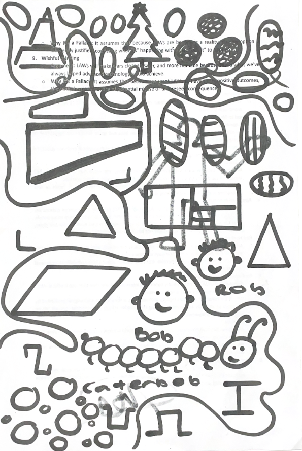

<h1>Wingbox Designer AE2111-I</h1>

This is the python code used for the course AE2111-II by group B03 for WP4-5 (2024) :)
<h1>Notes and Prerequisites</h1>
The code was run using Python version 3.10 or better, with the following prerequisites:

- numpy
- intersect
- sympy
- scipy
- alive_progress (absolutely necessary)

The code takes a design inputted by the user in code and evaluates its performance under different loadings in the flight envelope. This includes a bending displacement requirement, twist requirement, buckling performance and damage tolerance in tension.
<h1>Usage</h1>
The designs are inputted in the file ACTUALLY_MAIN.py. Then you run this file to run the entire procedure. The requirements are hard-coded into the program so sorry not sorry :)
